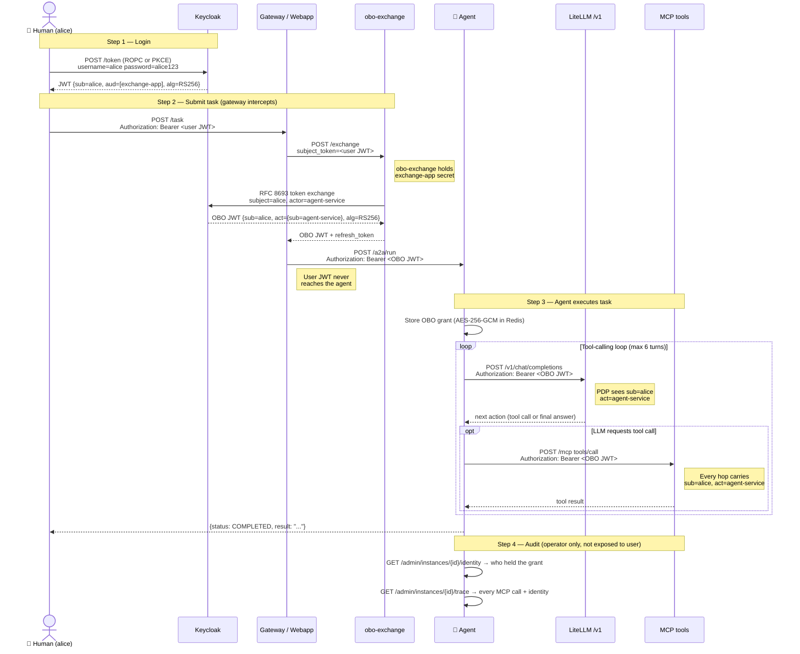
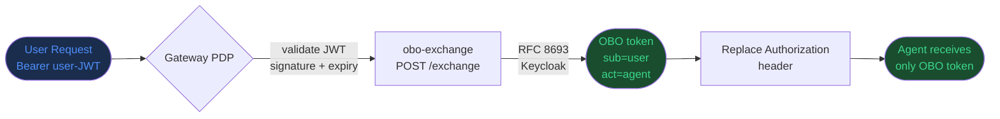
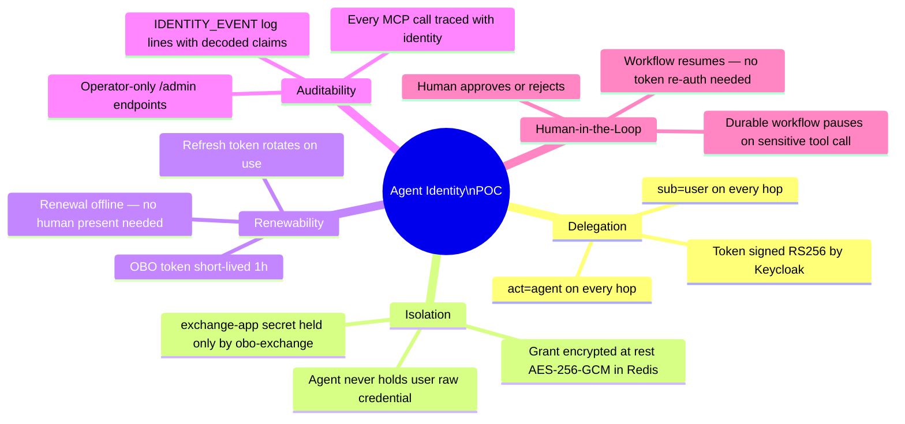
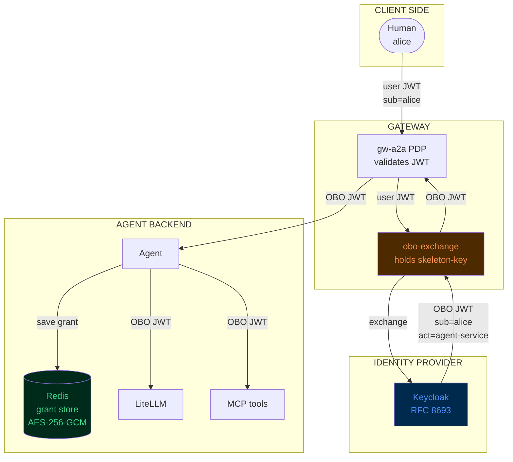
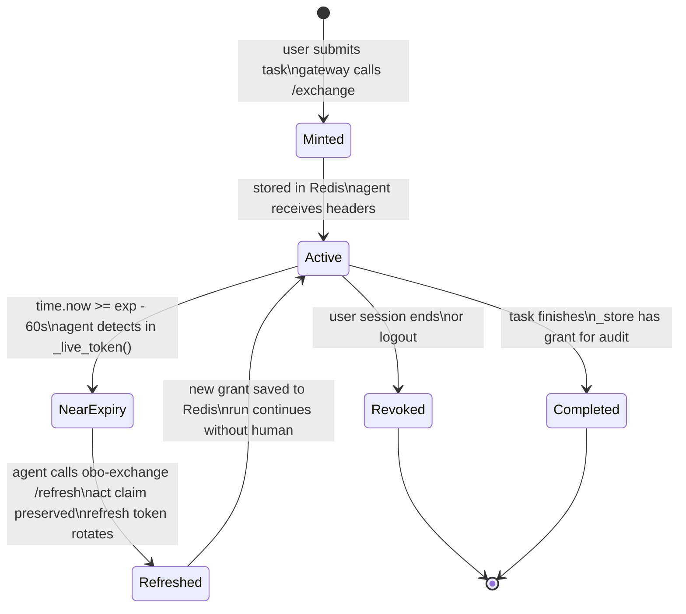
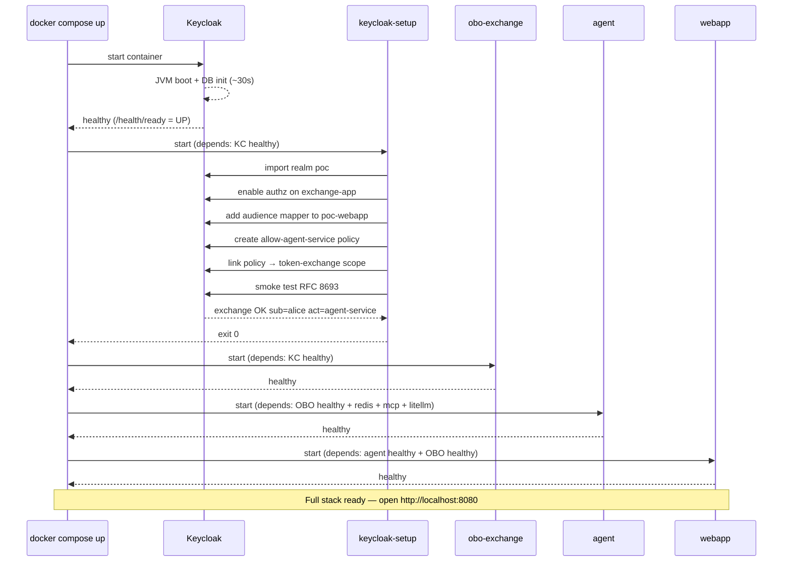
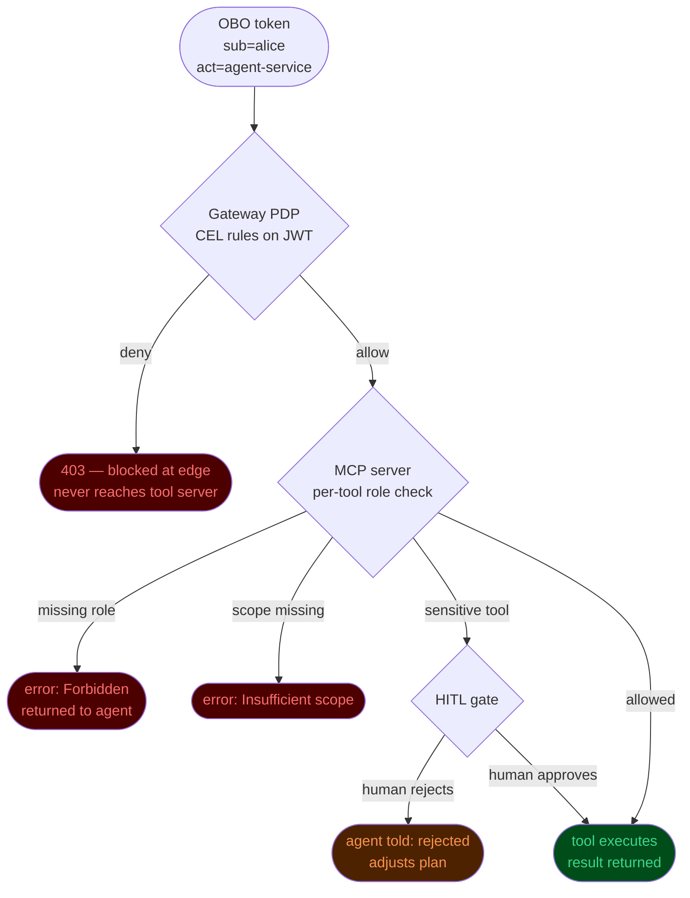

# Agent Identity POC — Architecture & Flow

## What this demonstrates

When an AI agent acts autonomously on behalf of a human, every system it touches
can see **both** identities — who the human is, and which agent is acting.
This enables fine-grained policy (allow/deny/audit) on individual agent actions,
with an optional Human-in-the-Loop gate for sensitive operations.

---

## Components

```
┌─────────────────────────────────────────────────────────────────────┐
│  LOCAL STACK (all Docker containers, no cloud, no VPN)              │
│                                                                     │
│  Keycloak :8180   obo-exchange :8081   LiteLLM :4000                │
│  Redis    :6379   mcp-mock     :8083   Agent   :8082                │
│  Webapp   :8080                                                     │
└─────────────────────────────────────────────────────────────────────┘
```

| Component | Role | Why it exists |
|---|---|---|
| **Keycloak** | Identity Provider (IdP) | Issues signed JWTs for users and services. Runs RFC 8693 token exchange. Source of truth for identity. |
| **obo-exchange** | OBO broker | Only service that holds the `exchange-app` client secret. Calls Keycloak to mint delegated tokens. Agent never touches this secret. |
| **Agent** | AI worker | Receives only the OBO grant, never the user's raw token. Calls LLM and MCP tools presenting the delegated identity on every hop. |
| **LiteLLM** | LLM proxy | OpenAI-compatible `/v1` endpoint. Routes to Ollama (local), OpenAI, Anthropic, or Bedrock. |
| **mcp-mock** | Tool server | MCP Streamable HTTP server with 4 demo tools (echo, list_deployments, get_service_health, list_pr_reviews). |
| **Redis** | Grant store | Stores OBO grants encrypted at rest (AES-256-GCM). Agent loads grants by `run_id`. |
| **Webapp** | Demo UI | Visualizes the full delegation chain step-by-step. Shows real JWT tokens decoded. |

---

## Keycloak client topology

```
poc-webapp          public PKCE app     ← human user logs in here
agent-service       service account     ← AI agent's own identity (actor)
exchange-app        confidential        ← holds skeleton key; runs RFC 8693
```

Trust relationship (configured by `keycloak-setup`):

```
poc-webapp tokens   include audience: exchange-app
agent-service       granted token-exchange permission on exchange-app
exchange-app        runs the RFC 8693 exchange (subject=user, actor=agent)
```

---

## Identity flow — step by step



---

## Token anatomy

### User JWT (from Keycloak, RS256)
```json
{
  "sub":   "8c8af53c-bcfc-4960-8874-bfb859aba5e0",
  "aud":   "exchange-app",
  "iss":   "http://localhost:8180/realms/poc",
  "email": "alice@poc.local",
  "exp":   1751234567
}
```

### OBO token (from Keycloak via RFC 8693, RS256)
```json
{
  "sub":   "8c8af53c-bcfc-4960-8874-bfb859aba5e0",
  "act":   { "sub": "agent-service" },
  "iss":   "http://localhost:8180/realms/poc",
  "scope": "openid profile email",
  "exp":   1751234567
}
```

**`sub`** = who owns the action (the human).  
**`act.sub`** = who is executing (the agent service account).  
Every downstream system that validates this token can enforce rules on both.

---

## What the gateway does (simulated by webapp in this POC)



In production this gateway is **agentgateway** (Envoy-based proxy with a PDP).
The `extAuth` filter intercepts every `/a2a` request, calls obo-exchange `/authz`,
replaces the `Authorization` header, then forwards to the agent.

---

## Security properties



---

## Trust boundary



**Red zone** (obo-exchange): sole holder of `exchange-app` client secret.  
**Blue zone** (Keycloak): sole issuer of signed tokens.  
**Green zone** (Redis): encrypted grant storage; token material never in plaintext.

---

## OBO token lifecycle



---

## Stack startup sequence



---

## Authorization: how the system decides what alice can do

The OBO token carries `sub=alice` — but knowing *who* alice is does not automatically
mean she can run every tool. Authorization happens at multiple independent layers.

### Layer 1 — Gateway PDP (before the request reaches MCP)

The gateway validates the JWT signature and evaluates CEL rules on the token claims.
Example rules (agentgateway config):

```yaml
# Allow /mcp only if alice has the 'ai-platform-user' role
- path: /mcp
  policy: jwt.roles.exists(r, r == "ai-platform-user")

# Block write tools for read-only users
- path: /mcp
  policy: >
    request.method == "POST" &&
    params.name in ["apply_terraform","merge_pr","delete_namespace"]
    ? jwt.roles.exists(r, r == "platform-admin")
    : true
```

If the policy returns false → **403 before the request touches any tool server**.

### Layer 2 — MCP server enforces per-tool rules

Each MCP tool server receives the full OBO token and can read its claims:

```python
# Example: mcp-mock enforcing roles on sensitive tools
SENSITIVE_TOOLS = {"delete_deployment", "apply_terraform", "merge_pr"}

def _exec_tool(name, arguments, bearer_claims):
    if name in SENSITIVE_TOOLS:
        roles = bearer_claims.get("realm_access", {}).get("roles", [])
        if "platform-admin" not in roles:
            raise PermissionError(
                f"tool '{name}' requires platform-admin — "
                f"sub={bearer_claims['sub']} has roles={roles}"
            )
```

This works because `sub=alice` is in the token — the MCP server can look up
alice's roles, group memberships, or any custom attribute Keycloak injected.

### Layer 3 — Scope negotiation at exchange time

The OBO token is minted with a specific `scope`. If alice's session does not have
`mcp:write` in scope, the token exchange can exclude it:

```
subject_token=alice-jwt
scope=openid profile email mcp:read     ← no mcp:write
→ OBO token has scope="openid profile email mcp:read"
```

The MCP server checks `scope` claim → refuses write operations without `mcp:write`.

### Layer 4 — HITL gate (Human in the Loop)

For tools flagged as sensitive regardless of role, the agent **pauses** and waits
for explicit human approval before executing. The workflow resumes only after the
human who launched the run calls `POST /a2a/hitl/runs/{id}/decision` with
`{"action":"approve"}`.

```
agent wants to call: delete_namespace
↓
HITL gate: pause workflow
↓ emit: {state: "input-required", tool: "delete_namespace", arguments: {...}}
↓ human sees notification
↓ human decides: approve / reject
↓ workflow resumes (approve) or tells LLM "call was rejected" (reject)
```

### Summary: who decides what



### Come funziona ORA nel POC (stato attuale)

Il POC dimostra il **trasporto** dell'identità, non l'enforcement.

| Layer | Stato nel POC | Cosa manca |
|---|---|---|
| Gateway PDP | Webapp simula extAuth senza CEL rules | Nessuna policy applicata sul path /mcp |
| MCP server | Logga `sub` e `act` — non blocca nulla | Nessun controllo ruoli sui tool |
| Scope | OBO include `openid profile email` | Nessun scope custom `mcp:read/write` |
| HITL | Disabilitato (`ENABLE_HITL=0`) | Nessun gate su tool sensibili |

**Cosa è verificato:**
- Il token che arriva al MCP ha `sub=alice act=agent-service` ✓
- L'agente non ha mai il token grezzo di alice ✓
- Ogni call MCP è tracciata con l'identità presentata ✓
- L'audit trail mostra chi ha fatto cosa ✓

### Come aggiungere enforcement (prossimi step)

**Step 1 — Ruoli Keycloak → token claims**

In Keycloak Admin: `Clients → poc-webapp → Client scopes → roles → add mapper "realm roles"`.
I ruoli di alice appaiono nel token come `realm_access.roles`.

**Step 2 — MCP server legge i ruoli**

```python
# services/mcp-mock/server.py — in _exec_tool()
SENSITIVE_TOOLS = {"delete_deployment", "apply_terraform", "merge_pr"}

if name in SENSITIVE_TOOLS:
    roles = claims.get("realm_access", {}).get("roles", [])
    if "platform-admin" not in roles:
        return JSONResponse({"jsonrpc":"2.0","id":id_,
            "error":{"code":-32603,
                     "message": f"Forbidden: {claims.get('sub')} lacks role platform-admin"}})
```

**Step 3 — Gateway CEL rule (agentgateway in produzione)**

```yaml
auth:
  proxy:
    rbac:
      enabled: true
      rules:
        - path: /mcp
          cel: jwt.realm_access.roles.exists(r, r == "ai-platform-user")
```

**Step 4 — HITL per tool ad alto rischio**

```python
# services/agent/agent.py
SENSITIVE_TOOLS = {"delete_deployment", "apply_terraform"}

# nel workflow agent_workflow:
if inner_tool in SENSITIVE_TOOLS:
    ctx.set_custom_status(json.dumps({"state":"input-required","gate":{...}}))
    decision = yield ctx.wait_for_external_event("decision")
    if decision.get("action") == "reject":
        # racconta al LLM che è stato rifiutato
        continue
```

### Flusso enforcement completo (quando tutti gli step sono attivi)

```
alice chiama:  POST /a2a/run {"task": "elimina il namespace staging"}
     ↓
[1] gateway valida JWT alice → ok, alice ha ruolo ai-platform-user → passa
     ↓
[2] gateway extAuth → OBO token {sub=alice, act=agent-service, scope=openid profile email}
     ↓
[3] agente gira il task, LLM decide di chiamare delete_namespace
     ↓
[4] HITL gate: delete_namespace è in SENSITIVE_TOOLS → workflow si ferma
    emit: {state: "input-required", tool: "delete_namespace", args: {ns: "staging"}}
     ↓
[5] alice riceve notifica: "l'agente vuole eseguire delete_namespace — approvi?"
     ↓
[5a] alice approva → workflow riprende
     ↓
[6] agente chiama MCP tools/call delete_namespace con OBO token
     ↓
[7] MCP server decodifica token:
    sub=alice → ha ruolo platform-admin? 
    NO → 403 Forbidden (alice non è admin, non può cancellare namespace)
     ↓
[8] agente riceve errore, lo dice a LLM, LLM risponde a alice:
    "Non hai i permessi per eliminare il namespace staging"
```

### The key insight

Without OBO, every MCP call shows `sub=agent-service`.
The tool server can only answer: *"is this agent allowed?"*

With OBO, every MCP call shows `sub=alice, act=agent-service`.
The tool server can answer: *"is alice allowed to do this via this agent?"*

The distinction matters for:
- **Different users → different permissions** (alice can deploy to staging, bob can deploy to prod)
- **Audit** (the action is attributed to alice, not to a generic service account)
- **Revocation** (alice's session ends → all in-flight tool calls using her sub become unauthorized)
- **Rate limiting** (per-user quota, not per-agent quota)

---

## Differences: POC vs Production

| Aspect | POC | Production |
|---|---|---|
| IdP | Keycloak in Docker | Keycloak or Zitadel on EKS |
| Gateway | webapp simulates extAuth | agentgateway (Envoy) with extAuth filter |
| TLS | none (HTTP) | Internal CA, mutual TLS |
| User login | ROPC (password grant) | PKCE + browser |
| LLM | Ollama local | AWS Bedrock via gateway /v1 |
| HITL | disabled (`ENABLE_HITL=0`) | Dapr durable workflow |
| Grant store | Redis direct | Redis via Dapr state API |
| Audit endpoints | /admin/* in-process | Separate operator service |

---

## Quickstart

```bash
# 1. Prerequisites: Podman or Docker, Ollama with a model
ollama pull gemma4-12b-qat   # or any chat model

# 2. Configure LLM
cp .env.example .env
# edit .env — set OPENAI_API_KEY or ANTHROPIC_API_KEY, or leave blank for Ollama

# 3. Start
./scripts/start.sh

# 4. Open
open http://localhost:8080          # identity flow visualizer
open http://localhost:8180/admin    # Keycloak (admin/admin)

# 5. Test (unit → integration → E2E)
./scripts/test-flow.sh

# 6. Fix Keycloak token-exchange if needed (usually auto via keycloak-setup)
./scripts/fix-keycloak-token-exchange.sh
```
