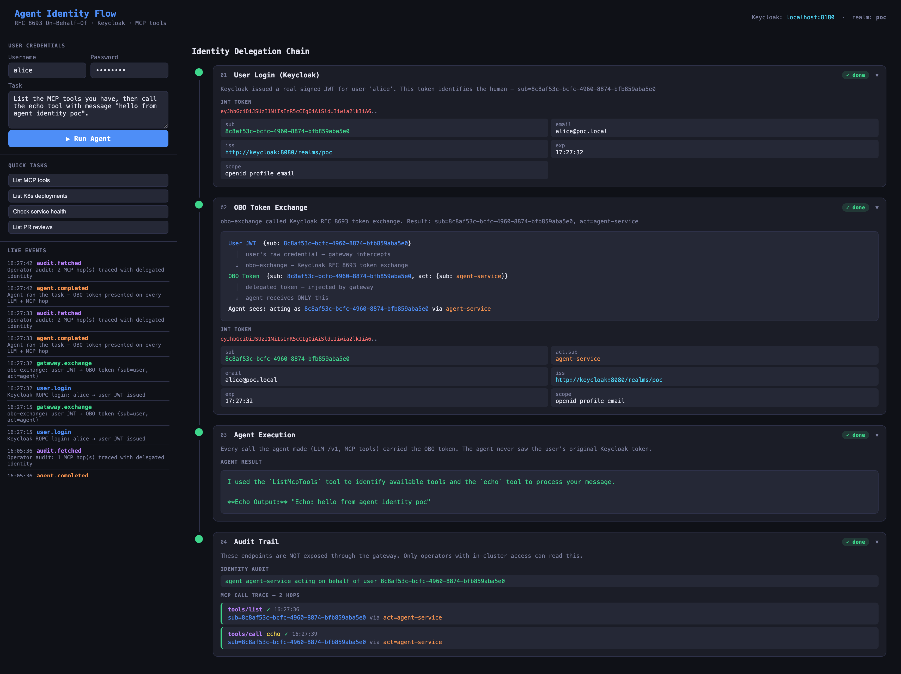
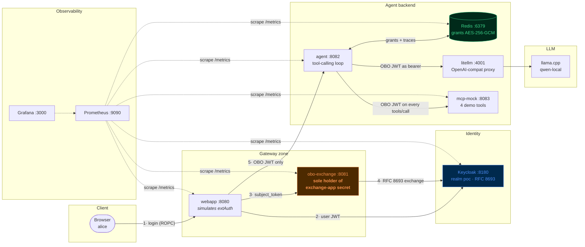
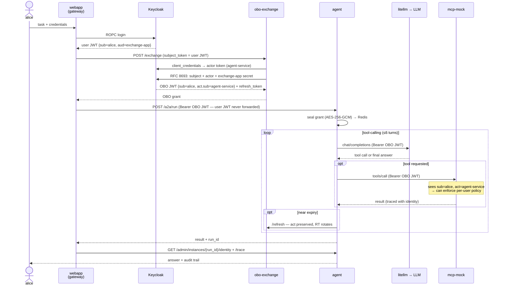
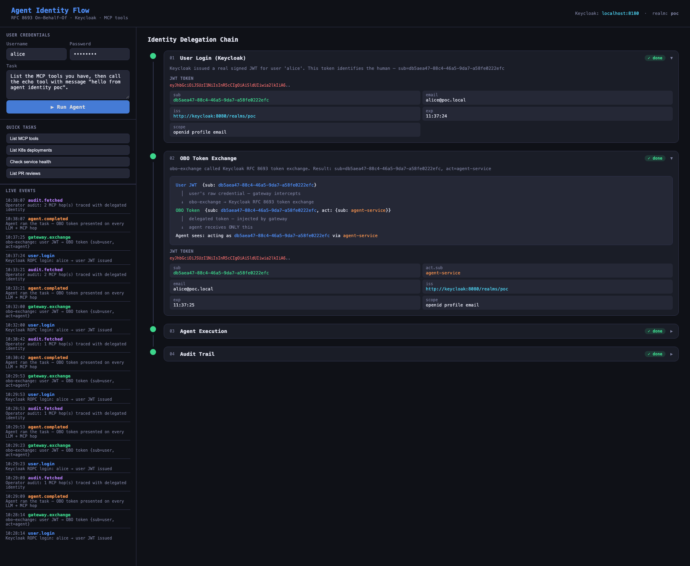
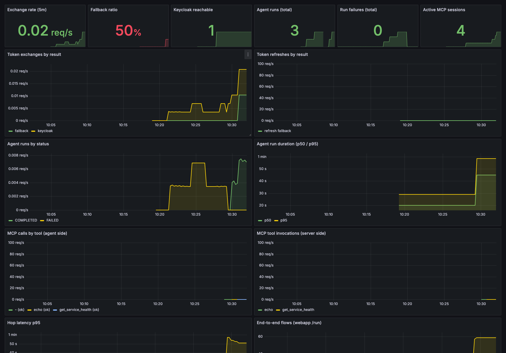
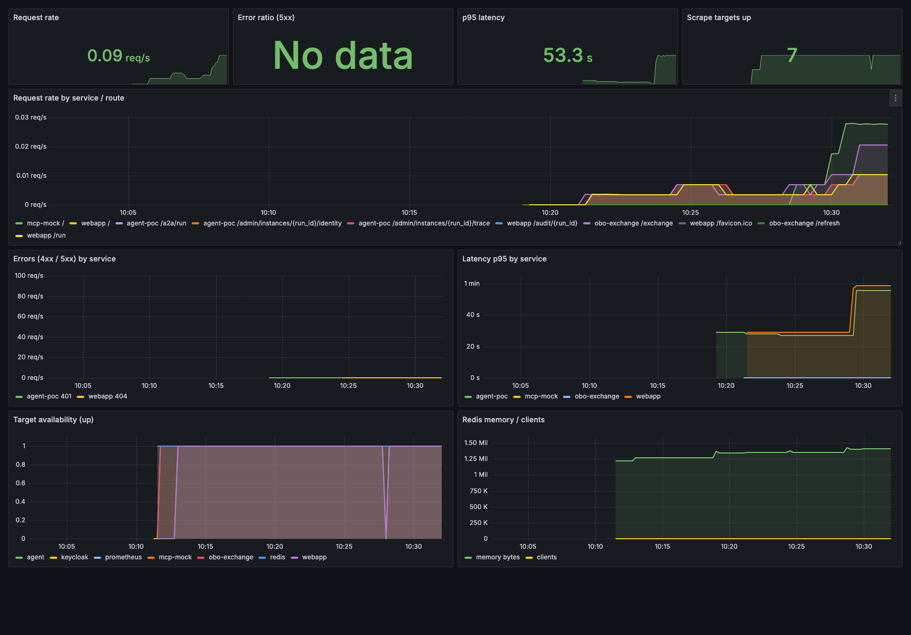
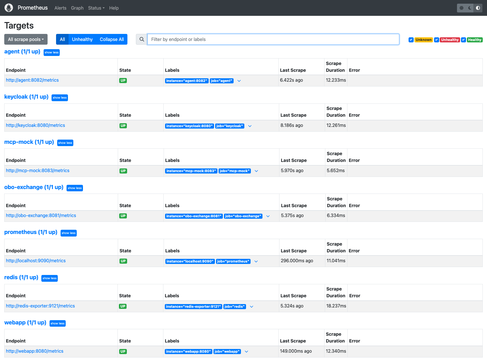

# Agent Identity POC — RFC 8693 On-Behalf-Of delegation for AI agents



## Purpose

When an AI agent acts autonomously on behalf of a human, the systems it touches
usually see only the agent's service account. They can answer *"is this agent
allowed?"* — but not *"is **this user** allowed to do this **via** this agent?"*

This POC demonstrates the fix: **RFC 8693 Token Exchange (On-Behalf-Of)**.
A human logs in, and a broker exchanges their token for a delegated token that
carries **both identities**:

```json
{
  "sub": "8c8af53c-...",              // the human (alice)
  "act": { "sub": "agent-service" },  // the agent acting for her
  "iss": "http://localhost:8180/realms/poc"
}
```

Every downstream hop — the LLM proxy, every MCP tool call — receives this token.
That enables per-user policy, per-user audit, per-user rate limiting, and
revocation, even when the action is executed by an autonomous agent hours later.

Key security properties demonstrated:

- The agent **never sees the user's raw credential** — only the delegated (OBO) token.
- The token-exchange client secret is held by **one small broker service** only
  (skeleton-key pattern), never by the agent.
- OBO grants are stored **encrypted at rest** (AES-256-GCM) in Redis.
- Tokens are **real RS256 JWTs signed by Keycloak** — not mocks.
- Every MCP call is **traced with the identity it presented** (audit endpoints).

This is a demo/educational stack — not production code. Primary audience:
platform engineers evaluating agent identity patterns.

> Deep dive: [ARCHITECTURE.md](ARCHITECTURE.md) (diagrams, token anatomy,
> authorization layers) and [MANUAL.md](MANUAL.md) (component-by-component
> explanation).

## What's in the box

Everything runs locally in Docker/Podman — no cloud, no VPN, no TLS setup.

| Port | Container | Role |
|---|---|---|
| 8180 | `poc-keycloak` | Real IdP (Keycloak 24), RFC 8693 token exchange, realm `poc` |
| 8081 | `poc-obo-exchange` | OBO broker — sole holder of the exchange-app secret |
| 8082 | `poc-agent` | AI agent: tool-calling loop, grant store, audit endpoints |
| 8083 | `poc-mcp-mock` | MCP Streamable HTTP server with 4 demo tools |
| 4000 | `poc-litellm` | OpenAI-compatible LLM proxy (Ollama / OpenAI / Anthropic) |
| 8080 | `poc-webapp` | Identity-flow visualizer UI (simulates the gateway) |
| 6379 | `poc-redis` | Grant store (AES-256-GCM encrypted OBO grants) |
| 9090 | `poc-prometheus` | Metrics — scrapes every service + Keycloak + Redis |
| 3000 | `poc-grafana` | Dashboards (anonymous admin, auto-provisioned) |

Demo users: `alice/alice123`, `bob/bob123`. Keycloak admin: `admin/admin`.
All secrets in this repo are demo values for the local stack only.

### Component map



### Sequence — one delegated run



## How to use it

### Prerequisites

- Docker (with `docker compose`) or Podman (with `podman-compose`)
- An LLM. Default is local [Ollama](https://ollama.com):

```bash
ollama pull gemma4-12b-qat   # or any chat model
```

### Start

```bash
# Optional: create .env to override defaults (all have working fallbacks)
# AGENT_MODEL=gpt-4o-mini            # OpenAI instead of Ollama
# OPENAI_API_KEY=sk-...
# ANTHROPIC_API_KEY=sk-ant-...
# OLLAMA_API_BASE=http://host.containers.internal:11434
# AGENT_STATE_AEAD_KEY=<base64 32B>  # keep grant encryption key stable across restarts

chmod +x scripts/*.sh
./scripts/start.sh
```

First boot takes ~2 minutes (Keycloak JVM boot + realm bootstrap + image pulls).
Subsequent starts: ~10 seconds.

### Explore

- **http://localhost:8080** — the visualizer. Log in as alice, submit a task,
  and watch each step: login → token exchange → agent run → audit trail, with
  every JWT decoded on screen. Step 2 should show `fallback=False` and
  `alg=RS256` — meaning Keycloak performed the real RFC 8693 exchange.
- **http://localhost:8180/admin** — Keycloak console (`admin/admin`, realm `poc`).
- **http://localhost:3000** — Grafana with two provisioned dashboards:
  *Agent Identity — Delegation Flow* (exchange rate, **fallback ratio**, run
  outcomes, per-tool MCP traffic, hop latencies) and *Agent Identity — Service
  RED* (rate/errors/duration per service). Prometheus raw at
  **http://localhost:9090**.

### Verify

```bash
./scripts/test-flow.sh   # test pyramid: unit → integration → E2E
```

Expected with the full stack up: `31 passed  0 failed` (8 unit checks run
even without the stack). Key assertions: `fallback=False` (real Keycloak
RS256 exchange, not the local HMAC fallback) and metrics counters actually
incrementing after the E2E run.

### Watch the identity flow in logs

```bash
./scripts/logs.sh agent
# [OBO] run=abc123 sub=8c8af53c act=agent-service has_refresh=True
# [MCP] run=abc123 tools/list sub=8c8af53c act=agent-service ok=True
```

Audit a run (operator-only endpoints):

```bash
curl http://localhost:8082/admin/instances/$RUN_ID/identity | python3 -m json.tool
curl http://localhost:8082/admin/instances/$RUN_ID/trace    | python3 -m json.tool
```

### Stop

```bash
./scripts/stop.sh
```

## Inside the JWT — fields, exchange mechanics, and permissions

### Anatomy

A JWT is three base64url segments — `header.payload.signature`:

```
eyJhbGciOiJSUzI1NiIsImtpZCI6Im...  .  eyJzdWIiOiI4YzhhZjUzYy...  .  hK3Xz9fQ...
        header                              payload                  signature
   {alg: RS256, kid: ...}         {sub, act, iss, exp, ...}    RSA over header.payload
```

It is **stateless**: any service can read the claims and verify the signature
against Keycloak's public keys (`/realms/poc/protocol/openid-connect/certs`,
selected by `kid`) without calling Keycloak. What it is *not*: encrypted —
anyone holding the token reads every claim. Never put secrets in claims.

### The fields, and who consumes them

| Claim | Example (this POC) | Who uses it, and for what |
|---|---|---|
| `iss` | `http://keycloak:8080/realms/poc` | Every verifier: token must come from *this* realm. Keycloak itself rejects a subject token whose `iss` doesn't match (see the dev-mode Host-header gotcha in `docs/CRITICAL_REVIEW.md §4b`) |
| `sub` | `db5aea47-...` (alice's UUID) | **The human owner of the action.** Survives the exchange untouched — this is the whole point. Downstream policy, audit, rate limits key on it |
| `act.sub` | `agent-service` | **Who is executing.** Added by RFC 8693 during the exchange. Lets a tool server distinguish "alice herself" from "an agent acting for alice" |
| `aud` | `exchange-app` | Gatekeeper of the exchange: Keycloak accepts a subject token only if its audience includes the exchanging client. The audience mapper on `poc-webapp` is what puts it there (setup step 4) |
| `azp` | `poc-webapp` | Authorized party — which *client* obtained the token. Used to derive a readable `act.sub` (the actor token's `sub` is a UUID; its `azp` is the client name) |
| `exp` / `iat` | unix timestamps | Lifetime. The agent refreshes when `now >= exp - 60s` (`near_expiry`), so long tasks survive token expiry without the human present |
| `jti` | random UUID | Unique token id — revocation lists and replay detection key on it |
| `scope` | `openid profile email offline_access` | Capability envelope. `offline_access` is what makes obo-exchange request a refresh token. Custom scopes (`mcp:read`, `mcp:write`) are the third enforcement layer |
| `email`, `preferred_username` | `alice@poc.local` | Display/audit convenience, injected by protocol mappers |
| `realm_access.roles` | `["platform-admin", ...]` | **The authorization payload.** Filled from Keycloak roles — which can be fed by AD groups (below). Tool servers read this to allow/deny |

### How the fields drive the exchange

```
user JWT {sub=alice, aud=exchange-app, azp=poc-webapp}          ← subject_token
agent JWT {sub=<uuid>, azp=agent-service}                        ← actor_token
        │
        ▼  POST /token  grant_type=urn:ietf:params:oauth:grant-type:token-exchange
Keycloak checks:
  1. subject_token signature + exp + iss valid
  2. aud contains "exchange-app"  → the exchanging client may consume it
  3. actor client has the token-exchange permission on exchange-app
        │
        ▼
OBO JWT {sub=alice, act={sub: agent-service}, scope=..., exp=+1h}
  + refresh_token   (because requested_token_type=refresh_token when
                     scope includes offline_access — Keycloak omits the
                     RT otherwise)
```

Every downstream hop receives the OBO token and can answer the two questions
separately: *whose* action is this (`sub`) and *what* is executing it (`act`).
On refresh, `act` is preserved and the refresh token rotates.

### From AD group to tool permission

The chain that turns "alice is in an Active Directory group" into "this MCP
tool call is allowed":

```
AD group  ──(1)──▶  Keycloak group/role  ──(2)──▶  claim in JWT  ──(3)──▶  enforcement
CN=Platform-Admins   realm role:              realm_access.roles:      tool server / gateway
                     platform-admin           ["platform-admin"]       checks the claim
```

**(1) AD → Keycloak.** Two standard options, zero application code:
- *User federation → LDAP*: Keycloak connects to AD, imports users, and a
  **group-ldap-mapper** syncs AD groups to Keycloak groups.
- *Identity brokering*: users log in via ADFS/Entra ID (SAML/OIDC) and an
  attribute/claim mapper translates the incoming group claim.

Then map group → role: `Groups → Platform-Admins → Role mapping → platform-admin`.

**(2) Keycloak → JWT.** Roles appear in tokens via protocol mappers. In this
POC: `Clients → poc-webapp → Client scopes → roles` already includes the
*realm roles* mapper, so any role you give alice shows up as
`realm_access.roles` in her token — and, because RFC 8693 re-issues the token
for the same `sub`, in the **OBO token too**. Groups can also be exposed
directly with a *Group Membership* mapper (`groups: ["/Platform-Admins"]`).

**(3) Claim → permission.** Enforcement reads the claim wherever the request
lands. Per-tool example for mcp-mock (full version in
[ARCHITECTURE.md §Authorization](ARCHITECTURE.md)):

```python
TOOL_POLICY = {
    # tool            required role        what it guards
    "query_database": "db-reader",       # SELECT on the reporting DB
    "delete_deployment": "platform-admin",
    "call_billing_api": "billing-user",  # outbound API with cost
}

def _authorize(name: str, claims: dict) -> None:
    required = TOOL_POLICY.get(name)
    if required is None:
        return                                    # unrestricted tool
    roles = claims.get("realm_access", {}).get("roles", [])
    if required not in roles:
        raise PermissionError(
            f"tool '{name}' requires role '{required}' — "
            f"user {claims['sub']} (via {claims.get('act', {}).get('sub')}) "
            f"has {roles}")
```

The same claim drives every kind of backend permission, because the OBO token
travels on **every** hop:

| Resource | Where the check runs | What it reads |
|---|---|---|
| MCP tool (this repo) | tool server, per `tools/call` | `realm_access.roles` |
| Database access | the MCP tool that opens the connection — maps role → DB account/row-level policy | roles or `groups` |
| Internal API | the API's own gateway validates the *same* OBO token | roles + `scope` |
| Route-level cutoff | agentgateway CEL rule, *before* anything runs | any claim: `jwt.realm_access.roles.exists(r, r == "ai-platform-user")` |
| Sensitive ops | HITL gate — pause and ask the human, regardless of role | tool name + `sub` (who to ask) |

Key property: the decision is always *"is **alice** allowed to do this via
this agent?"* — never "is the agent allowed". Two users running the identical
agent on the identical task get different tool surfaces, and the audit trail
attributes every call to the human who owns it.

> ⚠️ Corollary: anything that ignores the token breaks the model. An LLM
> response cache keyed only on the prompt would happily serve alice's cached
> answer to bob — if you add caching, the cache key must include `sub`.

None of steps (1)–(3) are enforced in this POC by default (transport is
demonstrated, enforcement is documented): the exact activation steps are in
[ARCHITECTURE.md §Authorization](ARCHITECTURE.md).

## How to work on it

### Repo layout

```
ARCHITECTURE.md          ← diagrams, auth enforcement guide, token anatomy
MANUAL.md                ← technical explanation of each component
docs/CRITICAL_REVIEW.md  ← EA/SRE review: findings, fixes, deferred roadmap
docker-compose.yml       ← full stack definition
config/litellm.yaml      ← LiteLLM model routing
observability/           ← prometheus.yml + Grafana provisioning/dashboards
helm/agent-identity-poc  ← Helm chart: k8s deploy, every component optional

services/
  keycloak-setup/
    realm-poc.json       ← realm definition (users, clients, mappers)
    setup.sh             ← idempotent bootstrap incl. RFC 8693 permission setup
  obo-exchange/server.py ← RFC 8693 broker + local HMAC fallback
  agent/
    agent.py             ← FastAPI server + sync tool-calling loop + HITL stubs
    obo.py               ← OBOClient: actor-token cache, exchange, refresh
    grant_store.py       ← AES-256-GCM grant store on Redis
  mcp-mock/server.py     ← MCP session handler + 4 demo tools
  webapp/
    server.py            ← orchestrates login → exchange → agent → audit
    static/index.html    ← visualizer UI

scripts/
  start.sh / stop.sh / logs.sh
  test-flow.sh                     ← the test pyramid (31 checks with stack up)
  fix-keycloak-token-exchange.sh   ← repairs the RFC 8693 permission if setup failed
```

### Observability

Every Python service exposes:

- `GET /metrics` — Prometheus (RED metrics per route + domain metrics:
  `obo_exchange_total{result}`, `agent_runs_total{status}`,
  `agent_mcp_requests_total{tool}`, `mcp_tool_calls_total`,
  `webapp_flows_total{fallback}`, …)
- `GET /healthz` — liveness (process up)
- `GET /readyz` — readiness (critical dependencies reachable; 503 otherwise)

The one metric to watch: **`obo_exchange_total{result="fallback"}`** — any
nonzero rate means Keycloak stopped doing real RFC 8693 exchanges and the
broker minted locally-signed demo tokens instead. The Grafana *Delegation
Flow* dashboard turns this into a red ratio stat.









### Kubernetes (Helm)

`helm/agent-identity-poc` deploys the stack with every component optional and
externally wireable — point `config.kcIssuer` at an existing Keycloak,
`config.redisUrl` at an existing Redis, disable `litellm` in favor of your
LLM gateway. Default values fail closed (`ALLOW_LOCAL_FALLBACK=false`), run
non-root with read-only rootfs, and ship HPAs for obo-exchange and agent.
See [helm/README.md](helm/README.md).

### Development loop

Services are plain Python/FastAPI containers. After editing a service:

```bash
docker compose up -d --build agent    # rebuild + restart one service
./scripts/logs.sh agent               # follow its logs
./scripts/test-flow.sh                # confirm nothing broke
```

Keycloak realm changes go in `services/keycloak-setup/realm-poc.json` and/or
`setup.sh`; recreate the stack (`./scripts/stop.sh && ./scripts/start.sh`) to
re-run the bootstrap.

### Switching the LLM

Edit `config/litellm.yaml` and set `AGENT_MODEL` in `.env`:

```bash
AGENT_MODEL=gpt-4o-mini        # OpenAI (needs OPENAI_API_KEY)
AGENT_MODEL=claude-haiku       # Anthropic (needs ANTHROPIC_API_KEY)
AGENT_MODEL=ollama/llama3.2    # Ollama (use ollama_chat/ prefix in litellm.yaml)
```

Note: `gemma4-12b-qat` is a thinking model — it answers in `reasoning_content`
unless `think: false` is set. The shipped config already handles this.

### What is intentionally NOT enforced (good first contributions)

The POC demonstrates identity **transport**, not enforcement. Each missing layer
is documented with implementation steps in
[ARCHITECTURE.md §Authorization](ARCHITECTURE.md):

1. **MCP per-tool role checks** — mcp-mock logs `sub`/`act` but never blocks.
   Add `realm_access.roles` checks on sensitive tools.
2. **Gateway CEL rules** — the webapp simulates the gateway without policy.
3. **Custom scopes** — mint OBO tokens with `mcp:read` / `mcp:write` and
   enforce them in the tool server.
4. **HITL gate** — `ENABLE_HITL=0`; enable it to pause the workflow on
   sensitive tool calls until a human approves.

### Troubleshooting

| Symptom | Fix |
|---|---|
| Webapp Step 2 shows ⚠ `fallback=True` | `./scripts/fix-keycloak-token-exchange.sh && docker restart poc-obo-exchange` |
| LiteLLM `No connected db` | Remove `master_key` from `config/litellm.yaml` (needs PostgreSQL) |
| Agent returns 401 on direct `/a2a/run` | Missing OBO grant — go through the webapp, it performs the exchange first |
| Empty LLM answers with gemma4 | Thinking model — ensure `ollama_chat/` prefix + `think: false` in litellm.yaml |

More gotchas in [MANUAL.md §Troubleshooting](MANUAL.md).
